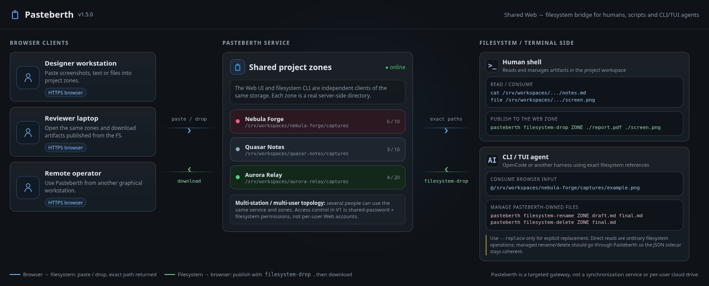
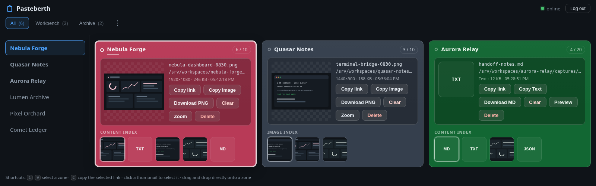

# Pasteberth Operator Guide

This guide is the detailed reference for installing, configuring, operating,
and integrating Pasteberth 2.1.0. The short project overview is in
[`README.md`](README.md); user-visible release history is in
[`CHANGELOG.md`](CHANGELOG.md).

Pasteberth is a targeted bridge between a graphical workstation, a filesystem,
and a terminal or CLI/TUI harness. It is not a general-purpose cloud drive and
it does not synchronize independent Pasteberth servers.

## Contents

1. [The Model](#1-the-model)
2. [Requirements and Support](#2-requirements-and-support)
3. [Installation](#3-installation)
4. [Configuration](#4-configuration)
5. [Web UI](#5-web-ui)
6. [Command-Line Interface](#6-command-line-interface)
7. [Bash Completion](#7-bash-completion)
8. [Filesystem Layout and Data Ownership](#8-filesystem-layout-and-data-ownership)
9. [Deployment](#9-deployment)
10. [Security and Trust Boundaries](#10-security-and-trust-boundaries)
11. [HTTP API](#11-http-api)
12. [Troubleshooting](#12-troubleshooting)
13. [Tests and Development](#13-tests-and-development)
14. [Backup, Upgrade, and Recovery](#14-backup-upgrade-and-recovery)
15. [Current Limits and Roadmap](#15-current-limits-and-roadmap)
16. [License](#16-license)

## 1. The Model

Pasteberth has one service and one or more configured **zones**. A zone is a
real directory on the machine running the service. The Web UI and the
filesystem CLI are independent clients of that same service and storage.

The usual flow is:

1. A person pastes an image, text, or file into the browser.
2. Pasteberth validates and stores it in the selected zone.
3. The browser receives the exact filesystem reference created by the server.
4. A harness or terminal process reads that reference on the server machine.

The reverse flow is also supported:

1. A script or agent runs `drop` for a file.
2. Pasteberth publishes it into a configured zone and creates its sidecar.
3. A browser user sees the new item and can download it.

The browser never needs to access the returned filesystem path. The path is
intended for the harness on the machine where Pasteberth runs.



### What Pasteberth is for

Pasteberth is useful when graphical and terminal work happen in different
contexts:

- a screenshot is produced on a workstation and must be read by a remote
  harness;
- an agent produces a report that a person needs to download in a browser;
- several projects need separate short-lived capture areas;
- a user needs a small, authenticated handoff service rather than a file
  sharing platform.

### What Pasteberth is not

- It is not a public file host, CDN, or object store.
- It is not a synchronization service between server instances.
- It does not provide individual Web accounts in v1.
- It does not watch arbitrary directories for changes.
- It does not make the browser able to read a server filesystem path.

## 2. Requirements and Support

The 2.1.0 implementation requires:

- Python 3.11 or newer;
- a local filesystem supported by the active platform backend;
- a modern browser for the Web UI;
- no third-party Python runtime dependency.

Linux is the current official and tested server platform for v2.1.0. The
Windows backend has broad Wine coverage, but native Windows/NTFS validation is
still outstanding and macOS support is not implemented. Do not infer support
for every network or exotic filesystem from the operating system name.

The supplied browser suite uses Chromium by default and can also run with
Firefox when the corresponding Playwright browser is installed.

## 3. Installation

### 3.1 Deployable copy

The supported v2.1.0 installation is the tracked `PasteBerth/` directory. It is
the complete code-only deployment unit: it needs no root access, installation
script, Python package installation, or build step.

```sh
git clone https://github.com/Fade78/pasteberth.git
cd pasteberth
cp -a PasteBerth "$HOME/PasteBerth"
mkdir -p "$HOME/.local/bin"
ln -s "$HOME/PasteBerth/pasteberth" "$HOME/.local/bin/pasteberth"
```

The executable is at the root of the deployment directory:

```sh
pasteberth --help
```

The executable resolves its physical target, so a symbolic link can live in any
directory on `PATH`:

```sh
export PATH="$HOME/.local/bin:$PATH"
pasteberth --version
```

The executable resolves the deployment directory before launching its private
runtime, replaces the inherited `PYTHONPATH`, and uses Python's `-P` safe-path
mode. It therefore does not provide a plugin mechanism through the current
directory or `PYTHONPATH`. A copy of the executable without the rest of the
deployment requires `PASTEBERTH_HOME=/absolute/path/to/PasteBerth`; `--config`
only selects configuration and never locates the runtime.

`pyproject.toml`, tests, browser tooling, documentation sources, and Git
metadata are repository material. They are not needed in the copied deployment.

### 3.2 First start

Generate a configuration, edit its zones, set the password, audit it, and
start the server:

```sh
pasteberth --generate-config
# edit ~/.config/pasteberth/config.toml: paths, zones, limits, and options
pasteberth passwd
pasteberth audit
pasteberth
```

Open `http://127.0.0.1:8765/` in the browser unless the configuration changes
the address or port. The generated configuration enables authentication. The
password hash is kept in a separate `passwd` file and is never written to
`config.toml`.

For a local trial, running without any configuration intentionally uses a
loopback-only minimal mode with `$XDG_DATA_HOME/pasteberth/storage/default`
(normally `~/.local/share/pasteberth/storage/default`) and no authentication.
This mode is suitable for a first look only; it must not be exposed through a
proxy or a non-loopback listener.

### 3.3 Configuration discovery

For normal execution, an existing configuration is selected in this order:

1. explicit `--config PATH`;
2. `PASTEBERTH_CONFIG`;
3. `$XDG_CONFIG_HOME/pasteberth/config.toml` (normally
   `~/.config/pasteberth/config.toml`);
4. built-in minimal mode when no file exists.

`--generate-config` writes to the explicit path or `PASTEBERTH_CONFIG`, then
to `$XDG_CONFIG_HOME/pasteberth/config.toml`. It never writes inside the
read-only deployment.
By default it refuses to replace an existing file; add the global `--force`
option only after checking the target path.

The active configuration, password file, TLS private key, and zone directories
must be outside `PasteBerth/`. These paths may contain symbolic links; Pasteberth
resolves the target before opening it and checks the target and its parents.

Use the same explicit `--config PATH` for `passwd`, `audit`, the server, and
filesystem commands when more than one configuration exists.

## 4. Configuration

Start from [`PasteBerth/support/config.example.toml`](PasteBerth/support/config.example.toml).
Configuration is TOML and is loaded when the service starts. Restart the server after changing
listeners, TLS, proxy trust, host allowlists, upload limits, zones, groups, or
authentication settings. The password hash is reloaded for every login
attempt, so changing it does not require a restart.

### 4.1 Top-level keys

| Key | Default | Meaning |
|---|---:|---|
| `listen_address` | `127.0.0.1` | Address on which the HTTP server listens. |
| `port` | `8765` | TCP listening port. |
| `max_upload_size` | `20MiB` | Maximum size of one upload; use `"unlimited"` for no application cap. |
| `max_image_pixels` | `25000000` | Structural image pixel budget; use `"unlimited"` to disable it. |
| `url_prefix` | `""` | Public path prefix such as `/paste`; the proxy must preserve it. |
| `show_full_path` | `true` | Display absolute file references in the Web UI; set `false` when paths are sensitive. |
| `trusted_proxies` | `[]` | IP addresses or CIDR networks allowed to provide `X-Forwarded-*`. |
| `allowed_hosts` | `[]` | Hostnames or IP addresses accepted by Host and Origin checks; empty means wildcard and triggers an audit warning. |
| `allow_unauthenticated_local` | `false` | Explicit opt-in for anonymous loopback or proxy mode. |
| `allow_unauthenticated_remote` | `false` | Explicit opt-in for anonymous non-loopback mode; discouraged. |
| `allow_insecure_http_remote` | `false` | Explicit opt-in for non-loopback HTTP on a controlled private network. |
| `accept_img` | `true` | Accept structurally valid PNG, JPEG, and WebP images. |
| `accept_doc` | `true` | Accept valid UTF-8 text without NUL bytes. |
| `accept_bin` | `true` | Accept opaque binary content. |
| `log_level` | `INFO` | One of `DEBUG`, `INFO`, `WARNING`, or `ERROR`. |

All three `accept_*` switches may be disabled, but disabling all of them
refuses every upload.

The `max_upload_size` limit applies to the extracted content. Multipart framing
and all other operational budgets are controlled in the optional `[limits]`
table. Each numeric or size value there accepts `"unlimited"`.

The available `[limits]` keys are `max_image_dimension`, `max_image_raw_size`,
`max_filename_length`, `max_filename_size`, `max_png_chunks`,
`max_jpeg_segments`, `max_webp_chunks`, `max_mime_length`,
`max_multipart_boundary_length`, `max_multipart_parts`,
`max_multipart_header_size`, `max_multipart_field_name_length`,
`max_batch_names`, `max_batch_body_size`, `max_comment_body_size`,
`max_http_header_size`, `max_login_body_size`, `max_login_fields`,
`max_login_delay_seconds`, `max_login_concurrent_checks`,
`max_login_tracked_ips`, `login_forget_after_seconds`,
`max_scrypt_memory_size`, `max_password_file_size`,
`max_metadata_size`, `max_comment_length`, `max_comment_bytes`,
`request_queue_size`, `max_active_requests`, `max_pending_requests`,
`http_header_timeout_seconds`, and `http_request_timeout_seconds`.
`request_queue_size` must remain a positive integer because it is passed to the
operating-system listen backlog; the other numeric and size budgets may use
`"unlimited"` where the operation supports it.

### 4.2 TLS

Pasteberth can terminate TLS directly:

```toml
[tls]
enabled = true
certificate = "/absolute/path/cert.pem"
private_key = "/absolute/path/key.pem"
```

The recommended deployment keeps Pasteberth on loopback and terminates HTTPS
in Caddy or nginx. A non-loopback listener must use direct TLS unless the
explicit private-network HTTP exception is enabled.

### 4.3 Authentication

```toml
[auth]
enabled = true
session_ttl_hours = 72
max_sessions = 4096
# password_file = "/absolute/path/to/passwd"
```

The password file defaults to `passwd` next to the selected configuration. It
contains a salted scrypt hash and should be readable only by the service user.
`pasteberth passwd` creates or replaces it safely. `max_sessions` bounds live
authenticated sessions held in memory; when the bound is reached, the oldest
session is evicted before a new one is created. Use `"unlimited"` to disable
FIFO eviction. It does not limit TCP connections or pending unauthenticated
requests.

### 4.4 Zones

Each `[[zones]]` table defines one independent project area:

| Key | Default | Meaning |
|---|---:|---|
| `id` | required | Lowercase API/UI identifier, up to 64 characters. |
| `label` | `id` | Human-readable UI label. |
| `type` | `local` | Only `local` is implemented in v2.1.0. |
| `directory` | required | Absolute path as seen by the server and the harness. |
| `retain` | `10` | Number of managed items retained in the zone. |
| `reference_prefix` | `@` | Text prepended to one returned reference. |
| `reference_suffix` | empty | Text appended to one returned reference. |
| `reference_list_prefix` | empty | Prefix for a copied list of references. |
| `reference_list_suffix` | empty | Suffix for a copied list of references. |
| `reference_separator` | `,` | Separator between references in a copied list. |
| `allow_zip_download` | `true` | Allow ZIP download for a multiple selection. |
| `color` | `#243447` | Six-digit zone background color. |
| `create_directory` | `true` | Create a missing zone directory when safe. |
| `min_free_percent` | `2.0` | Required free-space reserve on the zone filesystem. |
| `storage_mode` | `sidecar` | `sidecar` for managed pairs, or `directory` for root-file authority. |
| `max_items` | none | Required for `directory`; blocks new files without automatic deletion. |

The directory is not a browser path. It is the exact server-side directory
where the harness reads the stored content and where `drop` writes.
Zone directories must be distinct. A private `0700` directory is recommended;
deliberately shared directories are allowed but produce an audit warning when
their permissions are broad.

Example:

```toml
[[zones]]
id = "project-alpha"
label = "Project Alpha"
type = "local"
directory = "/absolute/path/to/Pasteberth/captures/project-alpha"
retain = 10
reference_prefix = "@"
reference_suffix = ""
reference_list_prefix = ""
reference_list_suffix = ""
reference_separator = ","
allow_zip_download = true
color = "#304237"
min_free_percent = 2.0
```

To copy a reference enclosed in backticks:

```toml
reference_prefix = "`"
reference_suffix = "`"
```

### 4.5 Zone groups

Groups control which zones are visible and how they are laid out:

| Key | Values | Meaning |
|---|---|---|
| `name` | non-empty string | Tab label. |
| `selection` | `all`, `pattern`, `other` | How zones are selected. |
| `pattern` | list of Python regexes | Required for `pattern`; uses case-sensitive `re.search`. |
| `layout` | `area`, `tab` | Grid view or opened-zone tab view. |
| `hide_empty` | boolean | Hide a group with no matching zones. |
| `show_count` | boolean | Show the matching zone count in the tab. |

Without a `[[groups]]` section, all zones are displayed through an implicit
`All` view and no group bar is shown. An `all` group contains every zone. A
`pattern` group matches zone IDs, not labels. An `other` group contains zones
not selected by any `pattern` group; `all` groups are deliberately ignored for
that calculation.

Groups are loaded at startup. `pasteberth audit` reports redundant groups,
ignored patterns on `all`/`other`, and equivalent effective selections.
The Group options menu can show or hide the left zone column for a `tab` group;
that preference is kept separately for each group in the browser.

### 4.6 Automatic zones

Repeatable `[[autozone]]` rules expose existing directories below an absolute
`base_directory` when their resolved relative path matches `pattern`. Discovery
does not create directories or edit configuration, and a configuration may use
autozones without any static `[[zones]]` entries. Each rule supplies a generated
group and uses `storage_mode = "directory"` with a required `max_items` limit.

Directory zones treat regular files at their root as managed items without
requiring sidecars. The limit blocks new writes but never deletes files;
previews, downloads, and explicit deletion remain available. The complete
contract, including aliases, reserved directories, diagnostics, and lifecycle,
is in [`docs/autozone-contract.md`](docs/autozone-contract.md).

## 5. Web UI

The browser view is a persistent workspace organized by zones.



### 5.1 Paste and drop

Click a zone or its selection button to make it the active paste target. Then:

- paste with `Ctrl+V` or `Command+V`;
- drop one or more files directly on a zone;
- use the file picker for one or more files.

Focusing an action button or history item does not change the active paste
target. A direct drop always targets the zone under the pointer. Several files
are uploaded sequentially as independent operations; one failed file does not
cancel the others.

For sidecar zones, the web UI asks for confirmation before an upload would
exceed `retain`, because the oldest managed items will then be removed. Directory
zones instead show a warning when `max_items` is reached and refuse new writes.
The server remains authoritative and reports the current blocked state in the
zone overview. A successful sidecar upload that removed items includes their
filenames in the `retention_deleted` response field; direct API clients should
inspect it.

After an upload, Pasteberth tries to copy the exact returned reference to the
clipboard. Clipboard permissions are controlled by the browser.

### 5.2 Content types

- PNG, JPEG, and WebP images receive previews when structural validation passes.
- Valid UTF-8 content without NUL bytes is displayed as text.
- Other content is treated as opaque binary.
- A declared MIME type does not decide whether an image is valid; content
  inspection does.
- An image-looking file that fails structural validation remains a binary item
  if `accept_bin` permits it.
- Mixed clipboard input containing an image and text is stored as one HTML
  document with embedded images. `Copy Text` restores both HTML and plain-text
  clipboard flavors.
- When copying stored `text/html`, `Copy Text` removes scripts, event handlers,
  CSS, forms, remote URLs, and non-raster resources from the HTML clipboard
  flavor. Embedded raster `data:` images are retained. The preview displays the
  sanitized text and never renders stored HTML. If sanitization changed the
  document, it exposes a red `Copy raw HTML` button for an explicit raw copy;
  storage and downloads always keep the original file unchanged.

Structural image validation checks containers, dimensions, chunk/segment
structure, and pixel budgets without fully decoding the codec bitstream. A
structurally valid but undecodable file can therefore have a broken preview;
the server never executes it. The default image budgets are `16,384 x 16,384`
pixels, 25 MP, and 256 MiB of encoded input; all are operator-configurable.

### 5.3 History and selection

The content index is the complete history for a zone, newest first. Click a
thumbnail or history item to select it in the upper panel.

- click selects one item;
- `Shift`-click selects a range;
- `Ctrl`-click or `Command`-click adds or removes an item;
- a multiple selection can copy all references, download a ZIP, or delete all
  selected managed items;
- the selected item exposes a `Comment` button for a short Unicode note;
- hovering the selected file or a history icon shows complete, untruncated item
  details;
- `show_full_path = false` hides absolute references in the UI while preserving
  them in API responses and copy actions.

Visible browsers poll for changes made by `drop` or another client
every 10 seconds. A browser tab that was hidden refreshes when it becomes
visible. Newly discovered items display a `NEW` badge on the zone and history
item until that item is selected; this indicator is local to the browser tab and
is reset when the page is reloaded.


The `C` shortcut copies the selected item's link. In tab layout, `A` opens all
visible zones and `U` closes them without changing the paste target. `Shift`-
click selects the contiguous range from the last non-range zone selection;
`Ctrl`-click or `Command`-click adds or removes one zone, and the same
modifiers with `Shift` add or remove a range. Number keys `1` through `9`
select a visible zone. Keyboard focus and selection do not silently redirect
paste operations.

The selected-content panel provides the reference and applicable content actions
for one item. For several selected items it instead lists filenames, sizes, and
stored dates, and exposes the group actions. Individual preview/download actions
are not shown in that state.

### 5.4 Retention

`retain = N` keeps at most N managed contents per zone. Retention runs after a
successful save under the zone lock and only removes a coherent data/sidecar pair
owned by Pasteberth. Foreign files and malformed or orphan sidecars are preserved.

## 6. Command-Line Interface

Use `pasteberth --help` for the parser's short reference and
`pasteberth --version` to print the version.

The command without a subcommand starts the server:

```text
pasteberth [--config PATH]
```

This form uses `log_level` from the selected configuration. To override it for
one invocation, use the explicit server subcommand:

```text
pasteberth serve [--config PATH] [--log-level LEVEL]
```

Global options are accepted before the subcommand. Subcommands also accept the
documented `--config` option after their name.

### 6.1 Configuration generation

```sh
pasteberth [--config PATH] --generate-config [--force]
```

The command writes a secure generated configuration and refuses to overwrite
an existing target unless `--force` is present. Review the target before using
`--force`.

### 6.2 Server

```sh
pasteberth serve [--config PATH] [--log-level DEBUG|INFO|WARNING|ERROR]
```

The server runs in the foreground. Stop it with `Ctrl+C` when running
interactively. `--log-level` overrides the configuration for that invocation.

### 6.3 Password

```sh
pasteberth passwd [--config PATH]
```

The command prompts twice, requires at least eight characters, and writes a
salted scrypt hash to the configured password file. It never writes a plaintext
password or modifies a hash when the selected configuration is invalid.

### 6.4 Audit

```sh
pasteberth audit [--config PATH]
```

`audit` checks configuration, directories, ownership, permissions, listener
policy, host policy, and TLS settings without modifying the deployment.

Exit codes are:

- `0`: no errors and no warnings;
- `1`: the configuration is usable but has warnings;
- `2`: one or more errors make the configuration unsafe or unusable.

Warnings include broad zone permissions, wildcard host checks, and other
conditions that may be intentional but deserve review.

### 6.5 Filesystem drop

```sh
pasteberth drop [--config PATH] [--replace] \
  /absolute/path/to/configured/zone /path/to/report.pdf /path/to/screen.png
```

The first positional argument is the exact absolute directory configured for a
zone. It is not the zone ID or UI label. One or more regular source files are
accepted. Sources remain unchanged and the command prints one returned
reference per successful source. The initial implementation is flat: each
source basename is stored directly in the zone, never in a source subdirectory.
If a source is already the exact file in the destination zone and has no
sidecar, Pasteberth adopts it by validating the content and creating only its
sidecar; the existing data file is not rewritten. A source outside the zone
with the same basename still cannot overwrite a foreign file.

Without `--replace`, an existing managed filename is refused. With
`--replace`, only a coherent Pasteberth-managed pair may be replaced. A foreign
file is never overwritten, even with `--replace`.

### 6.6 Filesystem rename

```sh
pasteberth rename [--config PATH] \
  /absolute/path/to/configured/zone old-name.pdf new-name.pdf
```

The source and target are basenames inside the configured zone. The data file
and its JSON sidecar are renamed transactionally. An existing target is never
replaced.

### 6.7 Filesystem delete

```sh
pasteberth delete [--config PATH] [--force] \
  /absolute/path/to/configured/zone report.pdf old-screen.png
```

Only coherent managed pairs are deleted. `--force` permits deletion when the
sidecar's recorded size is stale, but it does not make a foreign file or
malformed sidecar eligible for deletion.

### 6.8 Exit codes

Unless a parser error prevents command dispatch, the CLI uses these codes:

| Code | Meaning |
|---:|---|
| `0` | The command completed successfully; a server also returns this after a normal stop. |
| `1` | An operational error occurred, a filesystem batch was only partly successful, a server could not bind, or `audit` found warnings. |
| `2` | CLI syntax, configuration, startup policy, or the requested deployment path is invalid or unusable. |

## 7. Bash Completion

The deployment provides a self-contained Bash completion script at
[`PasteBerth/support/completions/pasteberth.bash`](PasteBerth/support/completions/pasteberth.bash).
It completes commands, options, log levels, configuration paths, and ordinary
filesystem arguments for filesystem operations.

The command can emit the same script directly, which is convenient for a
temporary shell integration:

```sh
eval "$(pasteberth completion)"
```

Use it for the current shell:

```sh
source PasteBerth/support/completions/pasteberth.bash
```

Install it for the current user:

```sh
mkdir -p "$HOME/.local/share/bash-completion/completions"
install -m 0644 PasteBerth/support/completions/pasteberth.bash \
  "$HOME/.local/share/bash-completion/completions/pasteberth"
```

On systems using the global bash-completion directory, an administrator can
install it with:

```sh
sudo install -Dm0644 PasteBerth/support/completions/pasteberth.bash \
  /etc/bash_completion.d/pasteberth
```

After installation, start a new shell or source the file again. The completion
does not inspect configuration contents to enumerate zone IDs: filesystem
commands intentionally receive the exact configured directory path, and the
server remains the authority for validating it.

## 8. Filesystem Layout and Data Ownership

A managed item consists of a regular data file and a matching JSON sidecar:

```text
zone/
  report.pdf
  report.pdf.json
```

The sidecar records metadata such as `filename`, `created_at`, `size`,
`width`, `height`, `format`, `kind`, and `mime`. Older valid sidecar schemas
remain readable. Pasteberth recognizes an item only when the data file and
sidecar are coherent. The `drop` command may make the exact source
file in its destination zone managed by creating that missing sidecar after
validation. Other foreign files remain outside managed operations.

Generated names use the form:

```text
YYYY-MM-DD_HH-MM-SS_<6 hex characters>.ext
```

For a browser drop, `preserve_name=1` retains a valid original filename. Names
default to 200 characters and 240 UTF-8 bytes; these two budgets are
configurable as `max_filename_length` and `max_filename_size`. Separators, NUL,
CR/LF, `.`/`..`, Pasteberth internal names, and transaction prefixes are rejected.
Names beginning with a dot, such as `.env`, are valid user names.

The following are internal and must not be edited or removed manually while a
service may be operating:

```text
.pasteberth.lock
.pbmeta-*
.pbdata-*
.pbbackup-*
.pbtxn-*
.pbtrash-*
.pbrename-*
.pbdel-*
```

All names beginning with these prefixes are reserved for Pasteberth and are
rejected by new Web and CLI uploads. Older zones may contain a client file
named `.pbdel-...` with its matching `.json` sidecar; that ambiguous pair is
preserved as a foreign artifact during recovery and is never executed as a
deletion journal. Do not rename, edit, or remove it while investigating an old
zone.

Zone directories are deployment state and must remain outside the read-only
`PasteBerth/` directory. Back them up separately if their contents matter. For
a clean backup, stop the service first or otherwise ensure no transaction is
active; copy managed data and matching sidecars together. Do not treat foreign
files as managed Pasteberth content.

## 9. Deployment

### 9.1 Foreground operation

For a manual start:

```sh
pasteberth audit --config /absolute/path/config.toml
pasteberth serve --config /absolute/path/config.toml
```

Keep the service bound to `127.0.0.1` when a reverse proxy terminates HTTPS.
For a directly exposed listener, configure TLS and an explicit `allowed_hosts`
list. The generated configuration enables authentication; with authentication
enabled, `allowed_hosts = []` deliberately accepts a hostname chosen by the
deployment. An anonymous configuration with an empty allowlist is rejected at
startup.

When the public URL is mounted below a path, configure the same path in
Pasteberth and forward it unchanged:

```toml
url_prefix = "/paste"
listen_address = "127.0.0.1"
trusted_proxies = ["127.0.0.1"]
allowed_hosts = []
```

Pasteberth does not infer this prefix from `Host`, `X-Forwarded-Host`, or any
other request header. The proxy must preserve `Host[:port]`, overwrite incoming
`X-Forwarded-*` headers, and be the actual peer listed in `trusted_proxies`.
The browser `Origin` is still `scheme://Host[:port]`, without `/paste`.

### 9.2 systemd user service

[`PasteBerth/support/deploy/pasteberth.service`](PasteBerth/support/deploy/pasteberth.service)
is an optional user service template. It needs no root and contains example
paths. Copy and adapt it only after generating, authenticating, and auditing the
configuration:

```sh
mkdir -p ~/.config/systemd/user
cp PasteBerth/support/deploy/pasteberth.service ~/.config/systemd/user/pasteberth.service
# edit --config and ReadWritePaths for this deployment
systemctl --user daemon-reload
systemctl --user enable --now pasteberth.service
journalctl --user -u pasteberth -f
```

The template uses `PrivateTmp=true`; zones below `/tmp` or `/var/tmp` are not
usable by other host processes in that mode. If optional `ProtectSystem`,
`ProtectHome`, or `ReadWritePaths` hardening is enabled, include every zone,
parent directory that may be created, and the password path when it must be
written.

To keep a user service running after logout and start it at boot:

```sh
loginctl enable-linger "$USER"
```

Enable linger only when that persistence is wanted.

### 9.3 Caddy

Keep Pasteberth on loopback and proxy the public HTTPS hostname:

```caddy
pasteberth.example.internal {
    @paste path /paste /paste/*
    reverse_proxy @paste 127.0.0.1:8765 {
        # Keep /paste in the upstream request; do not use handle_path here.
        header_up Host {http.request.hostport}
        header_up X-Forwarded-Proto {http.request.scheme}
        header_up X-Forwarded-For {http.request.remote.host}
        header_up X-Forwarded-Host {http.request.hostport}
    }
}
```

Use an authenticated wildcard or a matching explicit host allowlist:

```toml
listen_address = "127.0.0.1"
url_prefix = "/paste"
trusted_proxies = ["127.0.0.1"]
allowed_hosts = []                         # auth enabled: dynamic hostname
# allowed_hosts = ["pasteberth.example.internal"]  # optional strict host policy
```

Trusting `127.0.0.1` trusts every local process that can connect to the
listener, not only Caddy. Use it only when that boundary is acceptable.

### 9.4 nginx

```nginx
server {
    listen 443 ssl http2;
    server_name pasteberth.example.internal;
    # ssl_certificate …; ssl_certificate_key …;

    location = /paste {
        proxy_pass http://127.0.0.1:8765;
        proxy_set_header Host $http_host;
        proxy_set_header X-Forwarded-Proto $scheme;
        proxy_set_header X-Forwarded-For $remote_addr;
        proxy_set_header X-Forwarded-Host $http_host;
    }

    location /paste/ {
        # No URI suffix on proxy_pass: preserve /paste/... upstream.
        proxy_pass http://127.0.0.1:8765;
        proxy_set_header Host $http_host;
        proxy_set_header X-Forwarded-Proto https;
        proxy_set_header X-Forwarded-For $remote_addr;
        proxy_set_header X-Forwarded-Host $http_host;
        client_max_body_size 51m;
    }
}
```

The proxy body limit must be at least the configured upload and multipart
budgets. If the application upload limit is `"unlimited"`, configure the proxy
according to the maximum size appropriate for that deployment.
`X-Forwarded-*` headers from an untrusted peer are ignored.

## 10. Security and Trust Boundaries

Pasteberth is designed for a controlled project boundary, not anonymous public
uploads.

- Use HTTPS for every untrusted network connection. Passwords, sessions, and
  filesystem paths transit the application.
- Keep the backend on loopback behind a reverse proxy whenever possible.
- Keep authentication enabled and create the password with `pasteberth passwd`.
- With authentication enabled, leave `allowed_hosts` empty for a deployment-chosen
  hostname or list explicit canonical hostnames to restrict the service.
- Never leave `allowed_hosts` empty in an anonymous configuration.
- Configure only actual trusted proxy peers in `trusted_proxies`.
- Treat shared writable zones as a trust relationship between users who can
  modify the directory.
- Use private `0700` zones and private `0600` files when other local users must
  not inspect them.

The server uses salted scrypt hashes, constant-time password comparison,
server-side revocable sessions, `HttpOnly`/`SameSite=Lax` cookies, CSRF Origin
or Referer checks, strict security headers, configurable request and image
budgets, and progressive login throttling. The password hash uses the scrypt
`N=16384` work factor. Set the operational budgets in `[limits]`, or use
`"unlimited"` where the deployment accepts the associated resource risk.
Cookies gain `Secure` when the effective request scheme is HTTPS. The UI and
API responses are marked `no-store` and include CSP, `X-Frame-Options: DENY`,
`nosniff`, and `Referrer-Policy: no-referrer` headers.

A file without a coherent Pasteberth sidecar is foreign. Pasteberth never
overwrites, renames, or deletes such a file through managed operations. Linked
configuration, zone, source, and credential paths are resolved and checked;
unsafe entries inside a managed zone remain foreign. Transaction cleanup checks
object identity before destructive actions.

## 11. HTTP API

The API is same-origin and uses the session cookie. There is no CORS support in
v1. The supplied Web UI is the reference client.

### 11.1 Routes

The paths below are shown for a root deployment. When `url_prefix = "/paste"`,
prepend `/paste` to every route, including `/login`, static assets, API paths,
and previews. The prefix is a configured public path, not part of the browser
`Origin` value.

| Method | Path | Authentication | Purpose |
|---|---|---|---|
| `GET` | `/api/health` | public | Liveness probe. |
| `GET` | `/api/zones` | session | Zones, counts, group memberships, and zone settings. |
| `GET` | `/api/groups` | session | Group definitions and matching zone IDs. |
| `GET` | `/api/zones/{id}/images` | session | Complete zone history, newest first. |
| `POST` | `/api/zones/{id}/images` | session | Upload multipart content. |
| `PATCH` | `/api/zones/{id}/images/{filename}/comment` | session | Replace the item's short Unicode comment. |
| `DELETE` | `/api/zones/{id}/images/{filename}` | session | Delete one managed item. |
| `POST` | `/api/zones/{id}/images/batch-delete` | session | Delete several managed items. |
| `POST` | `/api/zones/{id}/images/archive` | session | Stream selected managed items as a ZIP. |
| `GET` | `/previews/{id}/{filename}` | session | Preview or download a managed item. |
| `GET` | `/login` | public | Login page when authentication is enabled. |
| `POST` | `/login` | public | Create a session from a password form, JSON body, or multipart form. |
| `POST` | `/logout` | session | Revoke the current session. |

`/api/zones/{id}/images` and its `images` response key cover images, UTF-8 text,
and opaque binary content. Each zone reports `busy`, copied-list formatting
settings, whether ZIP download is enabled, and its `storage_mode`. Directory
zones also report `max_items`, `blocked`, and an optional `block_reason`.
Each image may also include `changed_at`; it is `null` when the destination
cannot provide a change timestamp.

### 11.2 Upload

The multipart field is `image`. `preserve_name=1` retains a valid dropped
filename; `replace=1` together with `preserve_name=1` explicitly authorizes
replacing a coherent managed pair.

```sh
curl -b cookies.txt \
  -F image=@capture.png \
  https://pasteberth.example.internal/api/zones/default/images
```

Without `preserve_name=1`, the server generates the filename. A managed name
collision without `replace=1` returns `428 replacement_required`. A foreign
file collision returns `409 storage_conflict`. Low free space returns
`507 storage_low`; a full directory zone returns `507 storage_limit`.

API errors use a JSON object with this shape:

```json
{
  "error": {
    "code": "replacement_required",
    "message": "..."
  }
}
```

The main application error codes are:

| Status | Codes | Meaning |
|---:|---|---|
| `400` | `invalid_request`, `empty_upload`, `invalid_filename`, `invalid_image`, `invalid_comment` | The request or content is invalid. |
| `401` | `unauthorized` | A protected route has no valid session. |
| `403` | `forbidden_host`, `forbidden_origin`, `zip_disabled` | The host/origin is not allowed or ZIP is disabled for the zone. |
| `404` | `unknown_zone`, `unknown_image`, `not_found` | The requested resource does not exist. |
| `405` | `method_not_allowed` | The HTTP method is not supported for the requested resource. |
| `409` | `storage_conflict` | A foreign file or another storage conflict prevents the operation. |
| `413` | `too_large` | The request or content exceeds a configured limit. |
| `415` | `unsupported_media_type`, `unsupported_format` | The declared or detected content type is not supported. |
| `423` | `zone_busy` | Another operation holds the zone lock; inspect `Retry-After`. |
| `428` | `replacement_required` | Explicit replacement was required but not requested. |
| `429` | `rate_limited` | Login attempts are temporarily throttled. |
| `500` | `destination_error`, `internal` | The server could not complete a storage or internal operation. |
| `503` | `retention_error` | Retention cleanup could not complete. |
| `507` | `storage_low`, `storage_limit` | The free-space reserve or directory item limit would be exceeded. |

The response includes fields such as:

```json
{
  "id": "2026-08-25_01-22-31_a81c42.png",
  "filename": "2026-08-25_01-22-31_a81c42.png",
  "created_at": "2026-08-24T23:22:31.412000+00:00",
  "width": 1920,
  "height": 1080,
  "size": 9283,
  "format": "png",
  "kind": "image",
  "mime": "image/png",
  "comment": "Reference capture",
  "changed_at": "2026-08-25T01:22:31.412000+00:00",
  "preview_url": "/previews/default/2026-08-25_01-22-31_a81c42.png",
  "reference": "@/home/user/.local/share/pasteberth/storage/default/2026-08-25_01-22-31_a81c42.png"
}
```

### 11.3 Multiple operations

Batch deletion accepts repeated `filename` form fields or a JSON `filenames`
array. Archive accepts the same selection as a repeated form field or JSON
array and streams the ZIP without a temporary server archive.

Long-running deletion and archive operations hold an exclusive zone lock.
Conflicting requests return:

```text
423 zone_busy
Retry-After: 1
```

Clients should refresh the zone and retry after the indicated delay.

### 11.4 Comments

Comments are stored in the item's JSON sidecar and accept valid UTF-8 Unicode,
including emoji and line breaks. They are limited to 280 Unicode characters and
1 KiB of UTF-8 data; control, private-use, noncharacter, and invisible formatting
code points are rejected. In the Web UI, `Enter` inserts a line break and
`Ctrl`+`Enter` (or `Command`+`Enter`) saves the comment. Send a JSON object
containing only `comment`:

```sh
curl -b cookies.txt -X PATCH \
  -H 'Content-Type: application/json' \
  --data '{"comment":"Reference capture 🚀"}' \
  https://pasteberth.example.internal/api/zones/default/images/example.png/comment
```

An empty string clears the comment. Existing sidecars without a `comment` field
remain valid and are read as an empty comment. Unsafe requests must include the
same-origin `Origin` or `Referer` header.

### 11.5 Login clients

The login endpoint accepts a `password` field in a normal URL-encoded form,
multipart form, or JSON object. A successful login returns a session cookie and
redirects to the public root (`/` or the configured `url_prefix`). Failed
attempts are delayed and rate limited. A client should
preserve and resend the cookie for protected API calls, and should send the
same-origin `Origin` or `Referer` on unsafe requests.

## 12. Troubleshooting

### `pasteberth` starts without authentication

Check which configuration was discovered. No configuration means minimal
loopback mode. Use an explicit path consistently:

```sh
pasteberth audit --config /absolute/path/config.toml
pasteberth passwd --config /absolute/path/config.toml
pasteberth serve --config /absolute/path/config.toml
```

### The server refuses to start with authentication enabled

The selected `[auth]` configuration requires a readable valid scrypt hash.
Run `pasteberth passwd` against the same config and then `pasteberth audit`.

### `audit` returns status 1

The deployment is usable but has warnings. Review broad directory permissions,
wildcard host checks, proxy trust, listener policy, and TLS settings before
exposing it.

### A file is not visible in the history

Pasteberth only lists coherent data/sidecar pairs owned by Pasteberth. Check
that the file is regular, its sidecar is valid and readable, and no transaction
marker is active. Foreign files and malformed sidecars are deliberately left
alone.

### A request returns `423 zone_busy`

Another process is holding the zone's exclusive operation lock. Wait for the
`Retry-After` delay, refresh the history, and retry. Do not remove the lock
file manually.

### A filename replacement is refused

The name may be occupied by a foreign file, or the managed pair may require an
explicit replacement flag. Browser replacement requires confirmation;
filesystem and API operations require `--replace` or `replace=1`. Foreign
files remain protected even with that flag.

### systemd cannot see a zone or temporary source

Check `WorkingDirectory`, `ExecStart`, and every configured absolute path. With
`PrivateTmp=true`, a service-private `/tmp` is different from the host's `/tmp`.
Check the unit's `ReadWritePaths` if hardening is enabled.

### The browser cannot use a returned path

That is expected. The reference is for the harness on the Pasteberth server
machine. Use the browser's download action when a workstation needs a copy.

## 13. Tests and Development

The project has no runtime dependency beyond Python's standard library. Browser
tests use the Node development dependency declared in `package.json`.

Run the complete Linux suite:

```sh
npm ci
npm run test:all
```

Run individual suites when iterating:

```sh
python3 -m unittest discover -s tests -v
npm run test:e2e
E2E_BROWSER=firefox npm run test:e2e
```

The tests cover storage ownership and recovery, image validation and content
classification, filenames and replacement, configuration and startup policy,
authentication and CSRF, proxy headers, concurrency and zone locks, filesystem
CLI operations, frontend contracts, and browser interactions.

Before a public release, verify at least:

- `pasteberth --help` matches the completion script;
- every command example uses an actual parser option;
- all README and GUIDE relative links resolve;
- the public clone URL and current version are correct;
- all referenced images and configuration files are tracked;
- the full test suite is green.

## 14. Backup, Upgrade, and Recovery

Stop the service before a filesystem-level backup when practical. Preserve each
managed data file with its `.json` sidecar and preserve the directory structure.
Do not edit transaction markers or sidecars by hand.

On startup, Pasteberth reconciles interrupted transaction state. It is designed
to recover from crashes during publication, replacement, deletion, and rename
without treating foreign files as its own. Keep a copy of the zone before
manual recovery work.

An upgrade should use the same configured zone directories. Existing valid
sidecars and transaction markers from 1.5.0 are part of the compatibility
contract. Run `audit` after changing the executable or configuration, then
restart the service.

## 15. Current Limits and Roadmap

- only the `local` destination type is implemented;
- one service uses one shared authentication password in v1;
- sessions are in memory and a restart disconnects browsers;
- there is no directory watcher;
- there is no browser extension or CORS API;
- TLS is either direct or delegated to a reverse proxy;
- network and exotic filesystems are not automatically supported;
- mixed clipboard HTML may be larger than the original image-only payload;
- image validation is structural and not a full codec decode.

The next major platform goal is native Windows and macOS support with the same
transaction and security guarantees. That work is intentionally separate from
the v2.1.0 support matrix and must not be represented as already supported.

## 16. License

Pasteberth is licensed under the **GNU Affero General Public License v3.0 or
later** (AGPL-3.0-or-later). See [`LICENSE`](LICENSE).

If a modified Pasteberth is run as a publicly accessible network service, the
AGPL source-sharing requirements apply to users of that service.
