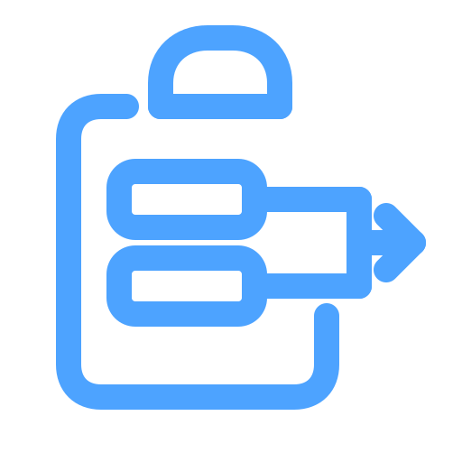
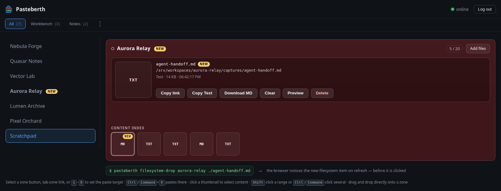

# Pasteberth

<p align="center">
  
</p>

**The bridge between a graphical clipboard, a filesystem, and a CLI/TUI
harness.**

Pasteberth lets a person move screenshots, text, and files from a graphical
workstation to the filesystem read by a terminal-based tool such as OpenCode.
It also lets an agent or script publish a file into a project area for a person
to download in the browser.


## Why Pasteberth?

Graphical and terminal work often happen in different environments. A browser
can receive clipboard content, but a remote harness cannot normally read that
browser clipboard. Conversely, a script can create an artifact on the harness
machine, but a person may need a simple browser download.

Pasteberth is the small, targeted handoff layer between those two sides:

- the browser pastes or drops content into a named project zone;
- the server stores it in a real filesystem directory;
- the harness receives the exact path created by the server;
- scripts can use `drop` to publish files back to the Web UI.

A zone is a directory on the machine running Pasteberth, with a JSON sidecar
for metadata and ownership. The browser never needs to access the returned
filesystem path.

Pasteberth is not a public file host, CDN, cloud drive, or synchronization
service between independent servers.

## Quick Start

The current public release is `2.0.0`. The documented v2.0.0 server runs on
Linux, requires Python 3.11 or newer, and has no third-party
Python runtime dependency. A native Windows backend is included but has only
been validated under Wine; macOS and native Windows remain outside the official
support matrix until real-OS validation is available.

```sh
git clone https://github.com/Fade78/pasteberth.git
cd pasteberth
cp -a PasteBerth "$HOME/PasteBerth"
mkdir -p "$HOME/.local/bin"
ln -s "$HOME/PasteBerth/pasteberth" "$HOME/.local/bin/pasteberth"
pasteberth --generate-config
# edit ~/.config/pasteberth/config.toml: set the zones and their absolute paths
pasteberth passwd
pasteberth audit
pasteberth
```

Open `http://127.0.0.1:8765/` and sign in with the password created by
`pasteberth passwd`.

For a first local trial, running without a configuration uses a loopback-only
minimal zone at `$XDG_DATA_HOME/pasteberth/storage/default` (normally
`~/.local/share/pasteberth/storage/default`). It has no authentication and must
not be exposed through a proxy or a non-loopback listener.

### Reverse Proxy And Mounted Paths

The generated configuration enables authentication and uses `allowed_hosts = []`
for a deployment-chosen public hostname. This wildcard is safe only with
authentication enabled; anonymous configurations must list their controlled
hosts explicitly.

To publish the service below `/paste`, keep the public path unchanged when
proxying to Pasteberth:

```toml
url_prefix = "/paste"
listen_address = "127.0.0.1"
trusted_proxies = ["127.0.0.1"]
allowed_hosts = []
```

The proxy must preserve `Host[:port]`, overwrite incoming `X-Forwarded-*`
headers, and be the only address listed in `trusted_proxies`. Do not strip
`/paste` before forwarding. The browser `Origin` remains the scheme and host
only, without `/paste`.

## What It Does

- Paste images, text, or files with `Ctrl+V`/`Command+V` or drag and drop.
- Keep independent zones per project with configurable retention.
- Return exact filesystem references such as
  `@/srv/workspaces/project/captures/example.png`.
- Preserve valid dropped filenames when requested, while protecting foreign
  files from accidental replacement or deletion.
- Select several items with click, `Shift`-click, or `Ctrl`/`Command`-click.
- Copy a reference list, download a selection as a streamed ZIP, or delete it
  as a group.
- Add a short Unicode comment to a managed item and edit it from the selected
  item panel.
- Hover the selected file or a history icon to see complete, untruncated item
  details.
- Publish files from scripts or agents with `drop`.
- Rename or delete managed files while keeping data and sidecars consistent.
- Run behind an HTTPS reverse proxy or terminate TLS directly.

## Browser Workspace


Click a zone to make it the active paste target. The content index shows the
zone's history, newest first. The `C` shortcut copies the selected item's link;
number keys select visible zones, and tab-layout groups support `A` to open all
visible zones and `U` to close them.

The upper panel shows the current item and its copy, download, clear, and
preview, and comment actions. With multiple selected items it shows their names,
sizes, and stored dates, then provides group actions instead. In a tab-layout group,
`Shift`-click selects a contiguous range of zones and `Ctrl`/`Command`-click
adds or removes zones; Group options can show or hide the left zone column.



The `show_full_path` configuration option controls whether absolute references
are displayed in the Web UI. It defaults to `true` for compatibility; set it to
`false` when server-side paths contain sensitive information. The API still
returns the exact reference needed by the harness and copy actions.

## Filesystem Handoff

The filesystem client targets the exact absolute directory configured for a
zone, not its UI label or identifier:

```sh
pasteberth drop --config config.toml \
  /srv/workspaces/project/captures /tmp/report.pdf /tmp/screenshot.png
```

The source files remain unchanged. Pasteberth creates managed data/sidecar
pairs and prints one reference for each successful source. Use `rename` and
`delete` for managed operations; foreign files are never overwritten or
removed. When a source is already the exact file in the destination zone,
`drop` validates it and creates its missing sidecar without rewriting the data
file.

## Documentation

[`GUIDE.md`](GUIDE.md) is the complete operator and integration guide. It
covers:

- installation, configuration, and the configuration discovery order;
- Web UI behavior, selection, clipboard handling, and content types;
- every CLI command, its syntax, and its exit codes;
- Bash completion in [`PasteBerth/support/completions/pasteberth.bash`](PasteBerth/support/completions/pasteberth.bash);
- filesystem layout, sidecars, retention, backup, and recovery;
- systemd, Caddy, nginx, TLS, authentication, and security boundaries;
- the HTTP API, batch operations, errors, and troubleshooting;
- tests, current support limits, and the future multiplatform direction.

User-visible release history is in [`CHANGELOG.md`](CHANGELOG.md).

The commented [`PasteBerth/support/config.example.toml`](PasteBerth/support/config.example.toml)
is the reference configuration template. The optional Linux user-service
template is [`PasteBerth/support/deploy/pasteberth.service`](PasteBerth/support/deploy/pasteberth.service).

## Support Status

| Area | v2.0.0 status |
|---|---|
| Python | 3.11 or newer |
| Server | Linux, officially tested |
| Destination | Local filesystem only |
| Browser | Chromium-tested; Firefox suite available |
| Windows/macOS server | Windows backend covered by Wine tests; native Windows/macOS not officially validated |
| Network/exotic filesystems | Not guaranteed without capability validation |

## License

Pasteberth is licensed under the **GNU Affero General Public License v3.0 or
later**. See [`LICENSE`](LICENSE).

If a modified Pasteberth is run as a publicly accessible network service, the
AGPL source-sharing requirements apply to users of that service.
